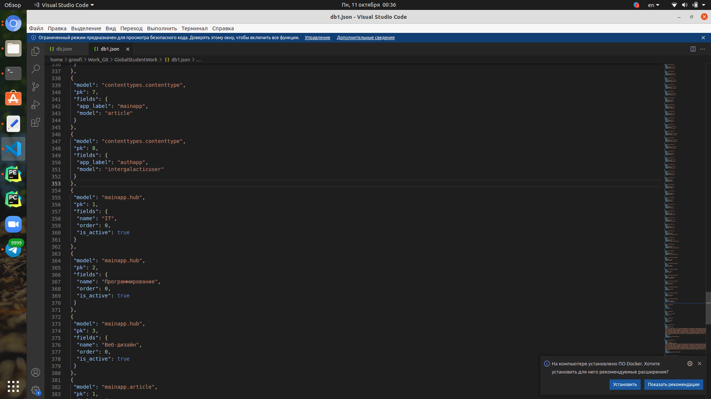

INTERGALACTIC
===============

Учебный проект для командной разработки...

Мануал по сносу бд, миграций и восстановление всего этого заново, если все совсем плохо:
1. Сносим все миграции(кроме __init__ в папках migrations) и базу данных.
2. Качаем или из репозитория, или находим в корне проекта файл db.json.
3. Заходим в терминал прописываем в корне проекта: 

::

    python3 manage.py makemigrations
    
затем

    python3 manage.py migrate
4. Прописываем в терминале в корне проекта 

::

    python3 manage.py loaddata
(Обращение к базе на загрузку) db.json (файл в проекте)
Все миграции накатились данные снова вернулись.

Для более опытных:
---------------------

Итак у нас новые корректировки в моделях, в итоге миграции не работают, а может и работают, но потом мы замержили и все перестало работать. Нам придется создать новый json файл с нашими изменениями.
1. Заходим в терминал и в корне проекта пишем команду python3 manage.py dumpdata(Обращение к базе на скачивание ее) --indent=1(Превратить json файл в человекочитабельный вид) > db.json(название json файла)

::

    python3 manage.py dumpdata --indent=1 > db.json
2. Заходим в json файл и удаляем ненужные данные их будет много. Как различить? ненужные идут по порядку до того момента, пока не увидите именно те данные, которые вносили руками вы и ваша команда. Пример:

Сверху мы видим модель о который ничего не знаем, а ниже произошел переход на те данные, которые мы сами вводили mainapp.hub.
3. После удаление ненужных строк, редактируем поля под нашу модель, которую мы изменили. Сохраняем.
4. Сносим все миграции(кроме __init__ в папках migrations) и базу данных.
5. Заходим в терминал прописываем в корне проекта 

::

    python3 manage.py makemigrations
затем 

::

    python3 manage.py migrate
6. Прописываем в терминале в корне проекта python3 manage.py loaddata(Обращение к базе на загрузку) db.json (файл в проекте)
